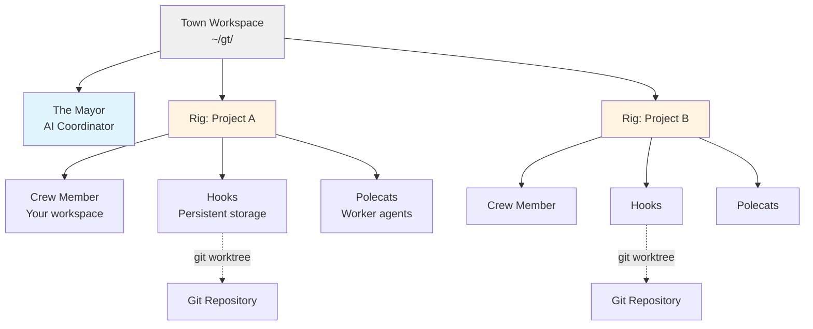
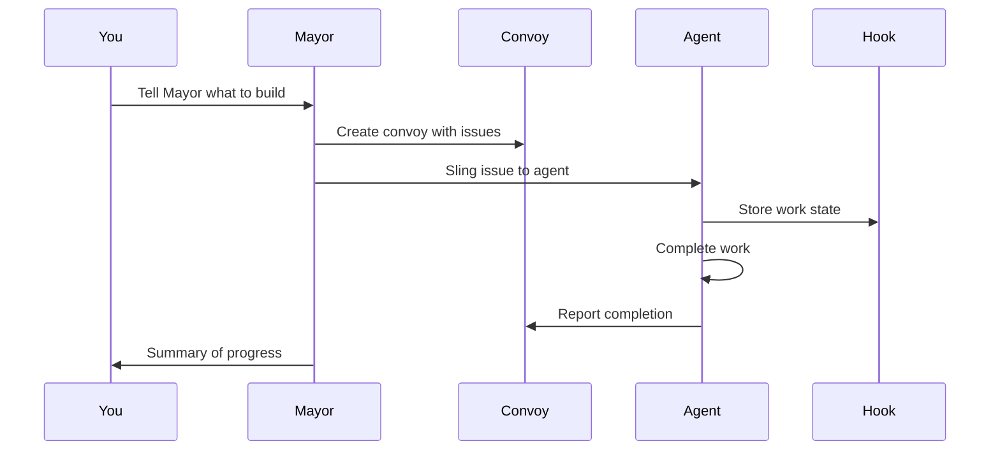
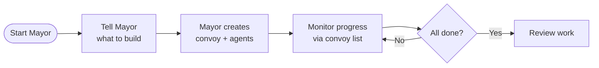
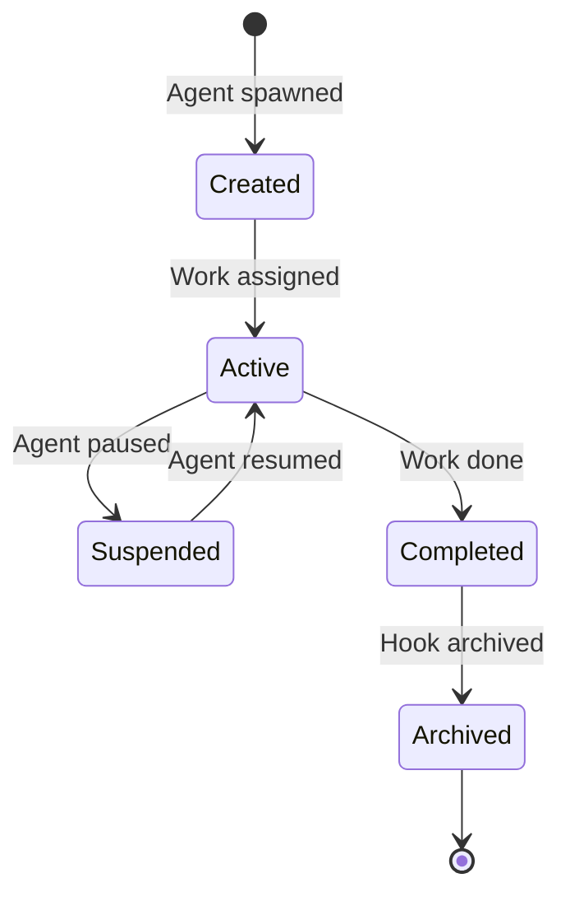

# Gas Town

**Multi-agent orchestration system for Claude Code with persistent work tracking**

## Overview

Gas Town is a workspace manager that lets you coordinate multiple Claude Code agents working on different tasks. Instead of losing context when agents restart, Gas Town persists work state in git-backed hooks, enabling reliable multi-agent workflows.

### What Problem Does This Solve?

| Challenge                       | Gas Town Solution                            |
| ------------------------------- | -------------------------------------------- |
| Agents lose context on restart  | Work persists in git-backed hooks            |
| Manual agent coordination       | Built-in mailboxes, identities, and handoffs |
| 4-10 agents become chaotic      | Scale comfortably to 20-30 agents            |
| Work state lost in agent memory | Work state stored in Beads ledger            |

### Architecture



## Core Concepts

### The Mayor 🎩

Your primary AI coordinator. The Mayor is a Claude Code instance with full context about your workspace, projects, and agents. **Start here** - just tell the Mayor what you want to accomplish.

### Town 🏘️

Your workspace directory (e.g., `~/gt/`). Contains all projects, agents, and configuration.

### Rigs 🏗️

Project containers. Each rig wraps a git repository and manages its associated agents.

### Crew Members 👤

Your personal workspace within a rig. Where you do hands-on work.

### Polecats 🦨

Ephemeral worker agents that spawn, complete a task, and disappear.

### Hooks 🪝

Git worktree-based persistent storage for agent work. Survives crashes and restarts.

### Convoys 🚚

Work tracking units. Bundle multiple issues/tasks that get assigned to agents.

### Beads Integration 📿

Git-backed issue tracking system that stores work state as structured data.

## Installation

### Prerequisites

- **Go 1.23+** - [go.dev/dl](https://go.dev/dl/)
- **Git 2.25+** - for worktree support
- **beads (bd) 0.44.0+** - [github.com/steveyegge/beads](https://github.com/steveyegge/beads) (required for custom type support)
- **tmux 3.0+** - recommended for full experience
- **Claude Code CLI** - [claude.ai/code](https://claude.ai/code)

### Setup

```bash
# Install Gas Town
go install github.com/steveyegge/gastown/cmd/gt@latest

# Add Go binaries to PATH (add to ~/.zshrc or ~/.bashrc)
export PATH="$PATH:$HOME/go/bin"

# Create workspace with git initialization
gt install ~/gt --git
cd ~/gt

# Add your first project
gt rig add myproject https://github.com/you/repo.git

# Create your crew workspace
gt crew add yourname --rig myproject
cd myproject/crew/yourname

# Start the Mayor session (your main interface)
gt mayor attach
```

## Quick Start Guide

### Basic Workflow



### Example: Feature Development

```bash
# 1. Start the Mayor
gt mayor attach

# 2. In Mayor session, create a convoy
gt convoy create "Feature X" issue-123 issue-456 --notify --human

# 3. Assign work to an agent
gt sling issue-123 myproject

# 4. Track progress
gt convoy list

# 5. Monitor agents
gt agents
```

## Common Workflows

### Mayor Workflow (Recommended)

**Best for:** Coordinating complex, multi-issue work



**Commands:**

```bash
# Attach to Mayor
gt mayor attach

# In Mayor, create convoy and let it orchestrate
gt convoy create "Auth System" issue-101 issue-102 --notify

# Track progress
gt convoy list
```

### Beads Formula Workflow

**Best for:** Predefined, repeatable processes

Formulas are TOML-defined workflows stored in `.beads/formulas/`.

**Example Formula** (`.beads/formulas/release.formula.toml`):

```toml
description = "Standard release process"
formula = "release"
version = 1

[vars.version]
description = "The semantic version to release (e.g., 1.2.0)"
required = true

[[steps]]
id = "bump-version"
title = "Bump version"
description = "Run ./scripts/bump-version.sh {{version}}"

[[steps]]
id = "run-tests"
title = "Run tests"
description = "Run make test"
needs = ["bump-version"]

[[steps]]
id = "build"
title = "Build"
description = "Run make build"
needs = ["run-tests"]

[[steps]]
id = "create-tag"
title = "Create release tag"
description = "Run git tag -a v{{version}} -m 'Release v{{version}}'"
needs = ["build"]

[[steps]]
id = "publish"
title = "Publish"
description = "Run ./scripts/publish.sh"
needs = ["create-tag"]
```

**Execute:**

```bash
# List available formulas
bd formula list

# Run a formula with variables
bd cook release --var version=1.2.0

# Create formula instance for tracking
bd mol pour release --var version=1.2.0
```

### Manual Convoy Workflow

**Best for:** Direct control over work distribution

```bash
# Create convoy manually
gt convoy create "Bug Fixes" --human

# Add issues
gt convoy add-issue bug-101 bug-102

# Assign to specific agents
gt sling bug-101 myproject/my-agent

# Check status
gt convoy show
```

## Key Commands

### Workspace Management

```bash
gt install <path>           # Initialize workspace
gt rig add <name> <repo>    # Add project
gt rig list                 # List projects
gt crew add <name> --rig <rig>  # Create crew workspace
```

### Agent Operations

```bash
gt agents                   # List active agents
gt sling <issue> <rig>      # Assign work to agent
gt sling <issue> <rig> --agent codex    # Override runtime for this sling/spawn
gt mayor attach             # Start Mayor session
gt mayor start --agent gemini           # Run Mayor with a specific agent alias
gt prime                    # Alternative to mayor attach
```

### Convoy (Work Tracking)

```bash
gt convoy create <name> [issues...] # Create convoy
gt convoy list              # List all convoys
gt convoy show [id]         # Show convoy details
gt convoy add-issue <issue> # Add issue to convoy
```

### Configuration

```bash
# Set custom agent command
gt config agent set claude-glm "claude-glm --model glm-4"
gt config agent set codex-low "codex --thinking low"

# Set default agent
gt config default-agent claude-glm

# View config
gt config show
```

### Beads Integration

```bash
bd formula list             # List formulas
bd cook <formula>           # Execute formula
bd mol pour <formula>       # Create trackable instance
bd mol list                 # List active instances
```

## Dashboard

Gas Town includes a web dashboard for monitoring:

```bash
# Start dashboard
gt dashboard --port 8080

# Open in browser
open http://localhost:8080
```

Features:

- Real-time agent status
- Convoy progress tracking
- Hook state visualization
- Configuration management

## Advanced Concepts

### The Propulsion Principle

Gas Town uses git hooks as a propulsion mechanism. Each hook is a git worktree with:

1. **Persistent state** - Work survives agent restarts
2. **Version control** - All changes tracked in git
3. **Rollback capability** - Revert to any previous state
4. **Multi-agent coordination** - Shared through git

### Hook Lifecycle



### MEOW (Mayor-Enhanced Orchestration Workflow)

MEOW is the recommended pattern:

1. **Tell the Mayor** - Describe what you want
2. **Mayor analyzes** - Breaks down into tasks
3. **Convoy creation** - Mayor creates convoy with issues
4. **Agent spawning** - Mayor spawns appropriate agents
5. **Work distribution** - Issues slung to agents via hooks
6. **Progress monitoring** - Track through convoy status
7. **Completion** - Mayor summarizes results

## Shell Completions

```bash
# Bash
gt completion bash > /etc/bash_completion.d/gt

# Zsh
gt completion zsh > "${fpath[1]}/_gt"

# Fish
gt completion fish > ~/.config/fish/completions/gt.fish
```

## Project Roles

| Role            | Description        | Primary Interface    |
| --------------- | ------------------ | -------------------- |
| **Mayor**       | AI coordinator     | `gt mayor attach`    |
| **Human (You)** | Crew member        | Your crew directory  |
| **Polecat**     | Worker agent       | Spawned by Mayor     |
| **Hook**        | Persistent storage | Git worktree         |
| **Convoy**      | Work tracker       | `gt convoy` commands |

## Tips

- **Always start with the Mayor** - It's designed to be your primary interface
- **Use convoys for coordination** - They provide visibility across agents
- **Leverage hooks for persistence** - Your work won't disappear
- **Create formulas for repeated tasks** - Save time with Beads recipes
- **Monitor the dashboard** - Get real-time visibility
- **Let the Mayor orchestrate** - It knows how to manage agents

## Troubleshooting

### Agents lose connection

Check hooks are properly initialized:

```bash
gt hooks list
gt hooks repair
```

### Convoy stuck

Force refresh:

```bash
gt convoy refresh <convoy-id>
```

### Mayor not responding

Restart Mayor session:

```bash
gt mayor detach
gt mayor attach
```

## License

MIT License - see LICENSE file for details

---

**Getting Started:** Run `gt install ~/gt --git && cd ~/gt && gt config agent list && gt mayor attach` (or `gt mayor attach --agent codex`) and tell the Mayor what you want to build!
